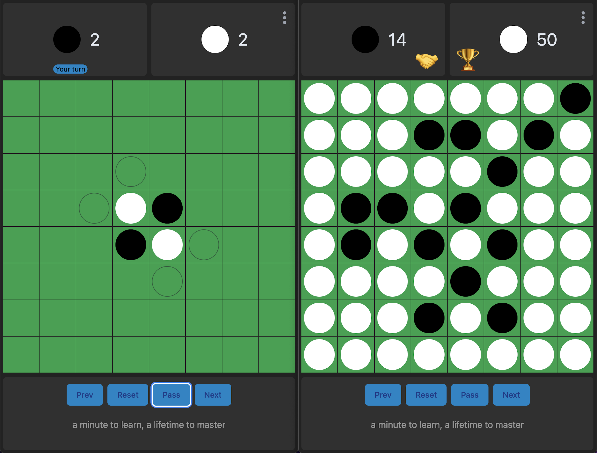

# Welcome to Othello App

### Othello (a.k.a Reversi)

Othello is a strategy board game for two players played on an 8x8 board.



[https://en.wikipedia.org/wiki/Reversi#Rules](https://en.wikipedia.org/wiki/Reversi#Rules)

[https://www.eothello.com/](https://www.eothello.com/)

### how to run

```
nvm use
npm i
npm start
```

## Logic

### Game & Board

- Cell[][] | Cell[]
- class Game | React state with helper functions
- [x] get legal moves | needs board & player
  - iterate through all cells
  - check to find legal moves
  - return them
- [x] is move legal | is legal move | move is legal :) needs position, board & player
  - We can put pieces in empty cells
  - Test **For** every direction(offset) **Of** offsets
    - check **If** step Is Legal With position & offset
      - continue → skip this direction if not a legal move
    - stepping one square from position towards offset (start count)
    - take a step in the same direction as long as it’s legal (inside the board and the pieces belongs to the opponent
      - step into the next cell and count++
    - **if** we **moved X steps** and the last cell belongs to og player → move is legal
  - no legal move is found in either direction → this move is illegal
- [x] is step legal | … needs position & offset
  - check for board edges
- [x] move | needs position, board, player
  - before calling this block, make sure you can move
  - similar to is move legal test **For** every direction(offset) **Of** offsets
    - check **If** step Is Legal With position & offset
      - continue → skip this direction if not a legal move
    - stepping one square from position towards offset (start count)
    - take a step in the same direction as long as it’s legal (inside the board and the pieces belongs to the opponent
      - step into the next cell and count++
    - **if** we **moved X steps** and the last cell belongs to the player who started the move
      - flip the row of legal move
- [ ] Lets PLAY
  - set board
  - set first player
  - game is **ON**…
  - check for legal moves of the player on board
    - **if** no legal move → switch player
  - **if** none of the player can’t make a legal move → game is over
  - get new move position from player (human, AI, server,…)
  - make the move
  - turn switch (player)
- [x] get score

### Cell

- Player | “empty”
- Player → player1,player2 | -1,1 | W, B | 1,2
- offset (-1,0|-1,-1|-1,+1|…)
- addOffsetToPoint(point, offset)
- subOffsetToPoint(point, offset)

### React things

-
-

## Features

- [ ] player 1 vs player 2, human vs human? human vs bot ? bot vs bot ?
- [ ] player vs team, team vs team, ...
- [ ] team ? { human, bot, server }
- [ ] pass turn
- [ ] new game/reset
- [ ] size of the board
- [ ] Offline support
- [ ] turn time / max turn time
- [ ] Move history
- [ ] keyboard support
- [ ] WebSocket
- [ ] Customize players | icons | users
- [ ] Local Storage (users, last game, history)
- [ ] audio ?
- [ ] best move, rank system for each cell… depends on the game ?
- [ ] random cells hiding things (good or bad, cancel the turn, flip disks with opponent color…)
- [ ]

## UI

### basic UI for playground

- [ ] Grid layout with svg for disks
- [ ]

### UI to Implement

- [ ] Transition on the box’s when mouse over
- [ ] valid box
- [ ] non valid box
- [ ] Icon | svg | emoji of each player disks ???
- [ ] Mouse click
- [ ]
